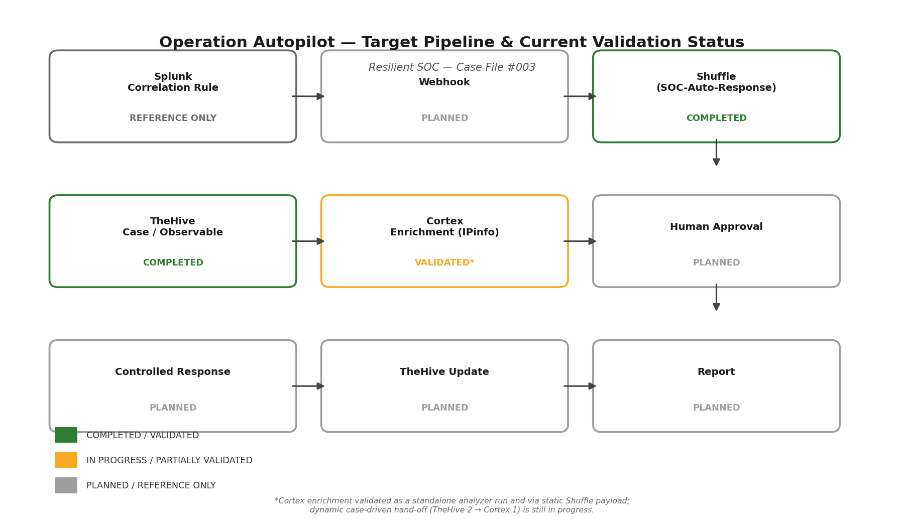
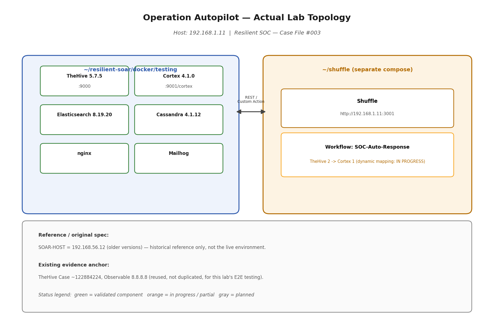
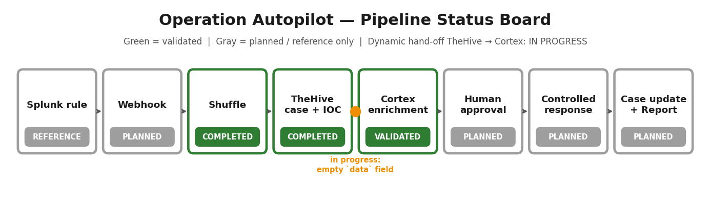
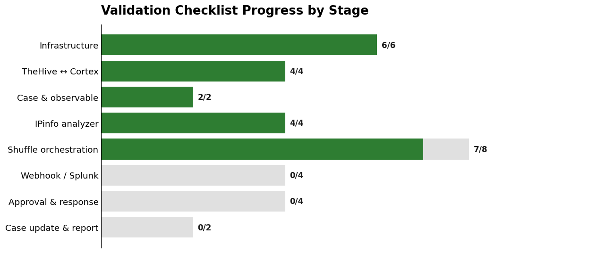
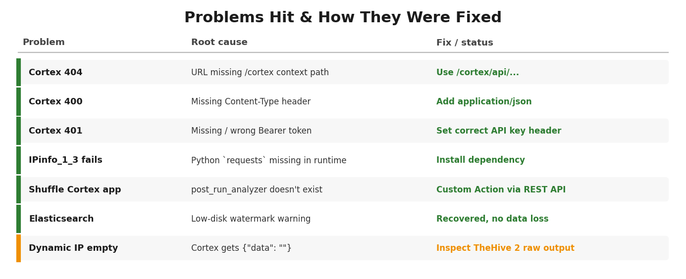

<div align="center">

# Resilient SOC — Case File #003
## Operation Autopilot
### From Detection to Automated Response — a hands-on SOAR integration lab


</div>

---

## Overview

**Operation Autopilot** is the third lab in the *Resilient SOC* training series. Cases #001 and #002 covered detection and investigation. This one goes further: **orchestration, enrichment, and human-approved response**.

The goal is a pipeline where a Splunk detection fires a webhook, Shuffle creates and enriches a TheHive case through Cortex, and an analyst approves any response action before it runs.

| Series | Focus |
|---|---|
| Case File #001 | SOC Foundation / Investigation |
| Case File #002 | Operation Nightfall |
| **Case File #003** | **Operation Autopilot — SOAR integration** |

> **Honest status note:** this is a living lab document. The core SOAR chain is built and validated component by component. The end-to-end Splunk-to-containment run has **not** happened yet, and this repo does not claim it did. Details below.

---

## Target Pipeline

<p align="center">
  
</p>

```text
Splunk → Detection Rule → Webhook → Shuffle → TheHive → Observable/IOC
      → Cortex → Enrichment → Human Approval → Controlled Response
      → TheHive Case Update → Report
```

**Human-in-the-loop is deliberate.** Automation handles the repetitive work (case creation, enrichment); a person signs off before anything touches an account or a firewall.

---

## Lab Architecture

Two Docker Compose stacks on one host, talking over REST.

<p align="center">
  
</p>

| Component | Role | Version | Address |
|---|---|---|---|
| **TheHive** | Case management | 5.7.5 | `:9000` |
| **Cortex** | Observable enrichment (analyzers) | 4.1.0 | `:9001/cortex` |
| **Shuffle** | Workflow orchestration | — | `:3001` |
| Elasticsearch | TheHive index | 8.19.20 | internal |
| Cassandra | TheHive database | 4.1.12 | internal |
| nginx / Mailhog | Proxy / mail sink | — | internal |

---

## Where the Lab Stands

<p align="center">
  
</p>

<p align="center">
  
</p>

| Stage | Status |
|---|---|
| Docker stack, TheHive, Cortex, Shuffle up and healthy | ✅ Completed |
| TheHive ↔ Cortex connection | ✅ Validated |
| Local analyzer `IPinfo_1_3` running against `8.8.8.8` | ✅ Validated |
| Shuffle → Cortex Custom Action (static payload, HTTP 200, job created) | ✅ Validated |
| Shuffle → TheHive observable retrieval (`TheHive 2` node) | ✅ Validated at node level |
| **Dynamic hand-off TheHive 2 → Cortex 1** | 🟠 **In progress** — Cortex receives an empty `data` field |
| Splunk correlation rule, webhook, human approval, controlled response, report | ⬜ Planned / reference only |

The current blocker and the exact troubleshooting checklist are in **Section 10** of the [lab guide](./SOAR-Lab-Guide.md).

---

## Problems Hit Along the Way

Every failure is documented with its root cause and fix, so the path is repeatable.

<p align="center">
  
</p>

Two that cost the most time:

- **Shuffle's built-in Cortex app** failed with `post_run_analyzer doesn't exist`. Fix: replace it with a **Custom Action** that calls the Cortex REST API directly.
- **Cortex API path.** Calls need the `/cortex` context prefix (`/cortex/api/...`), not just `/api/...`.

---

## Quick Start

```bash
# 1. Core stack: TheHive, Cortex, Elasticsearch, Cassandra, nginx, Mailhog
cd ~/resilient-soar/docker/testing
docker compose up -d

# 2. Shuffle (separate compose stack)
cd ~/shuffle
docker compose up -d

# 3. Check health
docker ps --format 'table {{.Names}}\t{{.Image}}\t{{.Status}}'
```

Service URLs, Cortex API routes, and the Custom Action config are in [`commands/lab-commands.txt`](./commands/lab-commands.txt).

> Secrets are placeholders such as `<CORTEX_API_KEY>`. Never commit real keys.

---

## 📂 Repository Layout

```text
.
├── README.md                     ← you are here
├── SOAR-Lab-Guide.md / .pdf      ← full build guide, implementation log, validation record
├── TEAM-NOTES.md                 ← decisions, open questions, lessons
├── docs-package-index.md         ← original package index and status summary
├── architecture/                 ← target design + actual topology
├── diagrams/                     ← end-to-end flow diagram
├── assets/                       ← status board, progress chart, troubleshooting map
├── commands/lab-commands.txt     ← copy-paste command reference
├── evidence/
│   ├── EVIDENCE-INDEX.md         ← what each screenshot should prove
│   └── VALIDATION-CHECKLIST.md   ← stage-by-stage checklist
└── screenshots/                  ← evidence slots (see note below)
```

> **About `screenshots/`:** the 25 files there are labeled placeholders that mark the planned evidence points. They are replaced with real captures as the lab progresses; [`EVIDENCE-INDEX.md`](./evidence/EVIDENCE-INDEX.md) tracks the status of each one.

---

## Read Next

1. [`SOAR-Lab-Guide.md`](./SOAR-Lab-Guide.md) — the full technical guide (PDF version alongside)
2. [`architecture/architecture.md`](./architecture/architecture.md) — design vs. what is actually running
3. [`evidence/VALIDATION-CHECKLIST.md`](./evidence/VALIDATION-CHECKLIST.md) — the authoritative status list
4. [`TEAM-NOTES.md`](./TEAM-NOTES.md) — the reasoning behind the decisions

---

##  Roadmap

- [ ] Fix the dynamic observable mapping (TheHive 2 → Cortex 1)
- [ ] Build the Shuffle webhook receiver and Splunk alert action
- [ ] Add the human-approval step (mechanism still undecided)
- [ ] Controlled response against a lab-only target
- [ ] Auto-update the TheHive case and generate the report draft
- [ ] Replace placeholder screenshots with real, secret-free captures

---

<div align="center">

**Resilient SOC** · Case RSOC-CF-003 · Educational lab documentation

</div>
